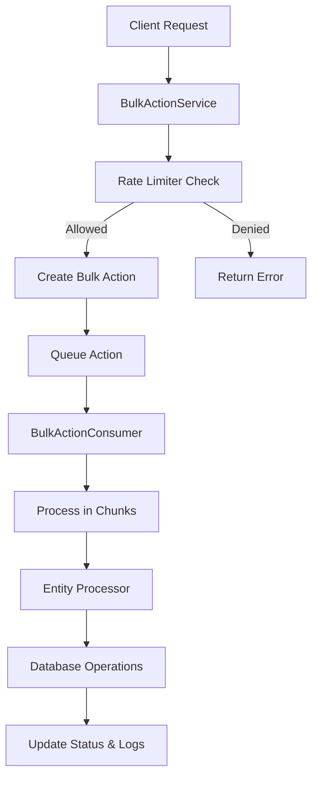

# Bulk Action Platform Flow

## Overview
The Bulk Action Platform is designed to handle large-scale operations on entities (Contacts, Companies, etc.) in a scalable and efficient manner. It supports both insert and update operations, with features like rate limiting, batch processing, and detailed logging.

## Core Components

1. **BulkActionService**
   - Handles creation and management of bulk actions
   - Processes files in chunks
   - Manages rate limiting
   - Queues actions for processing

2. **BulkActionConsumer**
   - Consumes queued actions from RabbitMQ
   - Processes actions in batches
   - Handles both insert and update operations
   - Manages logging and status updates

3. **Entity Processors**
   - Handles entity-specific logic
   - Validates records
   - Manages unique field checks
   - Processes insert/update operations

## Flow Diagram

## Detailed Flow

### 1. Initial Request
- Client sends a request to perform bulk operations
- Request includes:
  - Entity type (Contact, Company, etc.)
  - Action type (INSERT/UPDATE)
  - Data (records or file)

### 2. Rate Limiting
- System checks if the account has available quota
- If rate limit exceeded, request is rejected
- If allowed, proceeds to create bulk action

### 3. Bulk Action Creation
- Creates a new BulkAction record with:
  - Unique actionId
  - Account ID
  - Entity type
  - Action type
  - Initial status (PENDING)
  - Metadata

### 4. File Processing (if applicable)
- If request includes a file:
  - File is read in chunks
  - Each chunk is queued for processing
  - Total records count is updated

### 5. Queue Processing
- BulkActionConsumer picks up queued actions
- Processes actions in configurable batch sizes
- For each record:
  - Validates data
  - Checks for duplicates
  - Performs insert/update operation
  - Updates counters and logs

### 6. Entity Processing
- Entity-specific processor handles:
  - Record validation
  - Unique field checks
  - Data transformation
  - Database operations

### 7. Status Updates
- After each chunk:
  - Updates processed records count
  - Updates success/failure/skipped counts
  - Creates detailed logs
- On completion:
  - Verifies final counts
  - Updates status to COMPLETED
  - Handles any discrepancies

### 8. Logging
- Detailed logs created for:
  - Successful operations
  - Failed operations
  - Skipped records (duplicates)
  - System errors

## Error Handling

1. **Rate Limiting**
   - Returns error if quota exceeded
   - Includes retry-after information

2. **Validation Errors**
   - Records with invalid data are skipped
   - Detailed error messages in logs

3. **Duplicate Handling**
   - Records with duplicate unique fields are skipped
   - Counted in skipped records

4. **System Errors**
   - Failed operations are logged
   - System continues processing other records
   - Bulk action marked as completed with failures

## Performance Considerations

1. **Batch Processing**
   - Configurable batch size (default: 1000)
   - Reduces database load
   - Improves throughput

2. **Atomic Operations**
   - Uses MongoDB atomic operations
   - Prevents race conditions
   - Ensures accurate counting

3. **Queue Management**
   - RabbitMQ for reliable message delivery
   - Configurable prefetch count
   - Parallel processing support

## Extensibility

1. **Adding New Entities**
   - Create new entity processor
   - Implement IEntityProcessor interface
   - Add to entity helpers map
   - Update type definitions

2. **Custom Processing**
   - Override processor methods
   - Add custom validation
   - Implement unique field logic

## Monitoring

1. **Status Tracking**
   - Real-time progress updates
   - Success/failure/skipped counts
   - Detailed error logging

2. **Performance Metrics**
   - Processing time per chunk
   - Records processed per second
   - Error rates
   - Queue lengths 